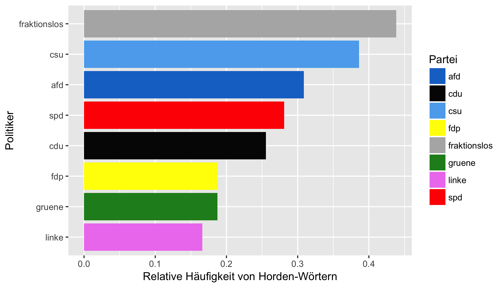

```{r setup, include=FALSE}

set.seed(1014)
options(digits = 3)

knitr::opts_chunk$set(
  collapse = TRUE,
  message = FALSE,
  warning = FALSE,
  cache = TRUE,
  echo = FALSE,
  out.width = "70%",
  fig.align = 'center',
  fig.width = 6,
  fig.asp = 0.618,  # 1 / phi
  fig.show = "hold",
  size = "tiny"
)
```


```{r libs}
library(tidyverse)
library(knitr)
library(pander)
```


# Theorie: Poppers Urhorde


## Poppers Theorie der "Urhorde" als Rahmen für Populismus

\vspace{1.5cm}

- Popper [@offges]:  
  *Stammesgesellschaft*  $\rightarrow$  *Individuumsgesellschaft*


## Poppers Theorie der "Urhorde" als Rahmen für Populismus (Details)

- Popper [@offges]: Entwicklung von *Stammesgesellschaft* zur *Individuumsgesellschaft*

- **Stammesgesellschaft**: Heldenepos, Heroen, Führerpersönlichkeiten, Ehre, Gewissheit über richtig/falsch, herrschende Kaste, zementierte Gesellschaftsstrukturen, "unser Boden", "unsere Blutsbande", "unser Stamm", Individuum als Teil des Stammes, Entwicklung kaum möglich, klare Regeln, klare Strafen, "wir gegen die", Stärke als Wert, Kampfesmentalität, totalitär, starke Kohäsionskräfte, Feinde sind nötig und werden gefunden

- **Individuumsgesellschaft**: Hinterfragen, Kritisieren, Ungewissheit, Zweifel, "Dahintreiben", Individuum als Individuum, schnelle Entwicklung möglich, Idee der Mündigkeit und Eigenverantwortlichkeit, Einsamkeit, humane Gesellschaft möglich


## Populismus als Sehnsucht nach der Sicherheit der Stammesgesellschaft 

- Menschen leiden (individuell unterschiedlich) am Verlust der Gewissheiten der Stammesgesellschaft

- Individuumsgesellschaft von Unsicherheit, Möglichkeiten und Nichtwissen geprägt -- Gefühl des "Dahintreibens" resultiert

- Populisten verheißen die Rückkehr zur Stammesgesellschaft


## Populismus heute -- im Aufwind?

- Zu Zeiten von *Umbrüchen* steigt das Leiden an der Individuumsgesellschaft; Stammesgesellschaft wird attraktiver

- Zu Zeiten des *Vormarschs der Individuumsgesellschaft* steigt das Leiden an ihr; Stammesgesellschaft wird attraktiver

- Zur Zeiten von *Krisen* steigt das Leiden an der Ungewissheit; der Wunsch nach Gewissheit steigt, die Stammesgesellschaft wird attraktiver


## Forschungsfragen

- Unterscheiden sich deutsche Parteien in ihrer Neigung zum Populismus?

- Tweetet die AfD besonders populistisch?

- Tweetet Trump am populistischsten?


# Methode: Twitter-Analyse


## Operationalisierung: Tweets

- Kommunikationsart der Parteien/Parteirepräsentanten durch Tweets erfasst

- Ermöglicht 
    - die Verarbeitung großer Datenmengen
    - das Anlegen objektiver Kriterien
    - hohe Reproduzierbarkeit


## Populismus-Score $\pi$

- Ungewichteter Median von z-Werten

```{r echo = FALSE}
pop_vars_de <- c(word_length_md_comp_z = "Wortkürze",
                 neg_words_ratio_z = "Verhältnis negativer/positiver Wörter",
                 neg_prop_z = "Anteil negativer Wörter",
                 emo_words_prop_z =  "Anteil emotionaler Wörter",
                 emo_score_neg_z =  "Wert an negativer Emotion",
                 emo_abs_score_z = "Wert an Emotionalität",
                 cap_prop_z = "Anteil GROSSBUCHSTABEN",
                 adj_adv_quote_z =  "Verhältnis von Adjektiven zu Adverben")

pop_vars_de %>% as.character
```


    

## Hypothese^[präregistriert; Datenerhebung läuft bis Ende 2017: <https://osf.io/bwszu>]

- Populismus-Reihenfolge: Trump > AfD > *sonstige*  


# Daten

## Stichprobe - Überblick

- $d \approx 400k$ Tweets deutscher Politiker
- $t \approx 32k$ Tweets von Donald Trump
- $w \approx 6.3 Mio$ Wörter
- $k = 200$ Twitter Accounts
- $p = 8$ politische Partein; P = {AfD, CDU, CSU, FDP, Grüne, Linke, SPD, (fraktionslos), Trump/GOP}
- Die Daten wurden im August 2017 gesammelt.


## Datenaggregation


## Zentrale Analyse-Schritte

1. Pro Politiker die Populismus-Indikatoren ($I_n$ $n \in 1..8$) berechnen
2. Ggf. umpolen und z-Werte berechnen für $I_n$
3. Gesamt-Populismuswert $\pi$ pro Person berechnen (Median)
3. Auf Partei-Ebene aggregieren (Median)


## Accounts^[Stand: August 2017] der Politiker

- [Liste](https://twitter.com/dw_politics/lists/german-politicians/members) "German Politicians" der [Deutschen Welle](http://www.dw.com/de/unternehmen/profil/s-30626)
- Twitter-Accounts des [Bundesvorstands der AfD](https://www.afd.de/partei/bundesvorstand/)
- Twitter-Accounts des [Präsidiuums der FDP](https://www.fdp.de/seite/praesidium)
- Markus Söder


## Tweets timeline


## Die meisten Accounts stammen von der SPD


## Die meisten Tweets stammen von der SPD


## Trump twittert wie verrückt 
Tweets pro Accounts pro Tag


## Grüne: Am meisten Gezwitscher; CSU: am wenigsten

Tweets pro Tag (Median)


# Ergebnisse: Teilweise bestätigend

## Trumps Populismus-Score ist am größten 

z-Werte


## Ohne Trump: Union/SPD am wenigsten populistisch

z-Werte


## AfD und Linke ähneln sich

... CSU, CDU und SPD auch


## "Top-10 der Populisten"^[cum grano salis] - zumeist von Der Linken

z-Werte


## Nahaufnahme des "Top-1-Populisten"^[cum grano salis]


## Beispiel-Tweets für "Top-1-Populisten"

```{r results = "asis"}
load("../../data_polit_twitter/top_1_pop_account_sample_tweets.Rdata")

top_1_pop_account_sample_tweets %>% 
  as_tibble %>% 
  rename(Tweet = value) %>% 
  mutate(Nr = 1:n()) %>% 
  select(Nr, Tweet) %>% 
  mutate(Tweet = paste0("\'",Tweet, "\\'")) %>% 
  slice(1:4) %>% 
  pandoc.table(split.cells = 70)
```


## "Horden-Score"^[basierend auf dieser Liste populistischer Wörter: <https://osf.io/b6ge7/>]




# Diskussion: Interessante Methode, viel Raum zur Verbesserung


## Stärken

- Neue, bisher wenig genutzte Methode
- Großer Datensatz (~6 Mio Wörter)
- Hohe Objektivität (in Teilen)
- Hohe Reproduzierbarkeit
- Wichtiges Thema


## Schwächen

- Indikatorenauswahl subjektiv?
- Weitere Analysen möglich/sinnvoll
- Repräsentativität (Twitter? Auswahl der Politiker?)

# Danke

## Kontakt

**Sebastian Sauer**  
\vspace{1cm}
Mail: sebastian.sauer@fom.de

twitter:   

  - [sauer_sebastian](https://twitter.com/sauer_sebastian?lang=en)  
  - [psy_pol](https://twitter.com/psy_pol)    
  
blogs: 

  - https://sebastiansauer.github.io  
  - https://sebastiansauer.github.io/psy_pol/ 

Folien: <https://osf.io/wv4fx>    
Daten^[dehydriert aus rechtlichen Gründen] und R-Code: <https://osf.io/wv4fx>


## Literatur
